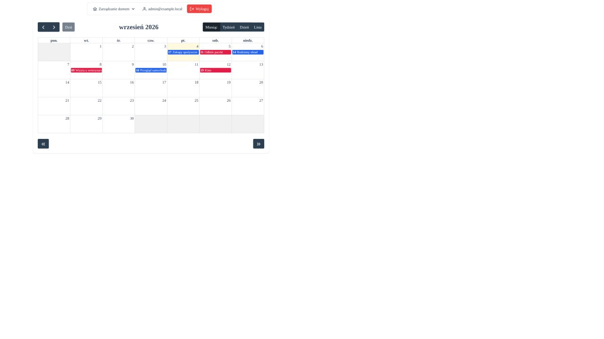
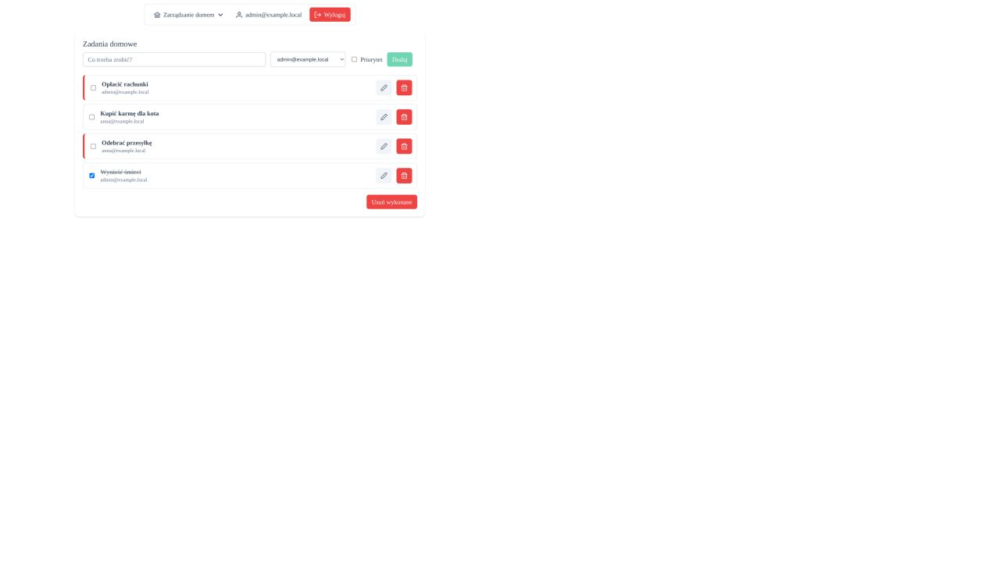

# HomeManagementWebClient

Klient Angular 20 dla aplikacji HomeManagement. Udostępnia logowanie, wspólny kalendarz, profil użytkownika i listę zadań gospodarstwa domowego.

## Zrzuty ekranu

### Logowanie


### Kalendarz

Wydarzenia `admin@example.local` są oznaczone kolorem niebieskim, a wydarzenia `anna@example.local` kolorem czerwonym.



### Zadania domowe



### Profil użytkownika


## Uruchomienie

API powinno działać pod adresem skonfigurowanym w `src/environments/environment.development.ts` (domyślnie `https://localhost:7065`).

```bash
npm ci
npm start
```

Klient będzie dostępny pod `http://localhost:4200`.

## Build produkcyjny

```bash
npm run build
```

Widoki są ładowane leniwie; cięższy moduł FullCalendar nie trafia do początkowego bundla.

## Testy

```bash
npm test -- --watch=false
```

Testy używają Vitest i `jsdom`, więc nie wymagają lokalnej instalacji Chrome.
